| Step | Description | Image |
|------|-------------|-------|
| 1 | Prepare all components. |  |
| 2 | Assemble “Part 7 – Side” and “Part 8 – Side Cover” together. Repeat for the other side. | 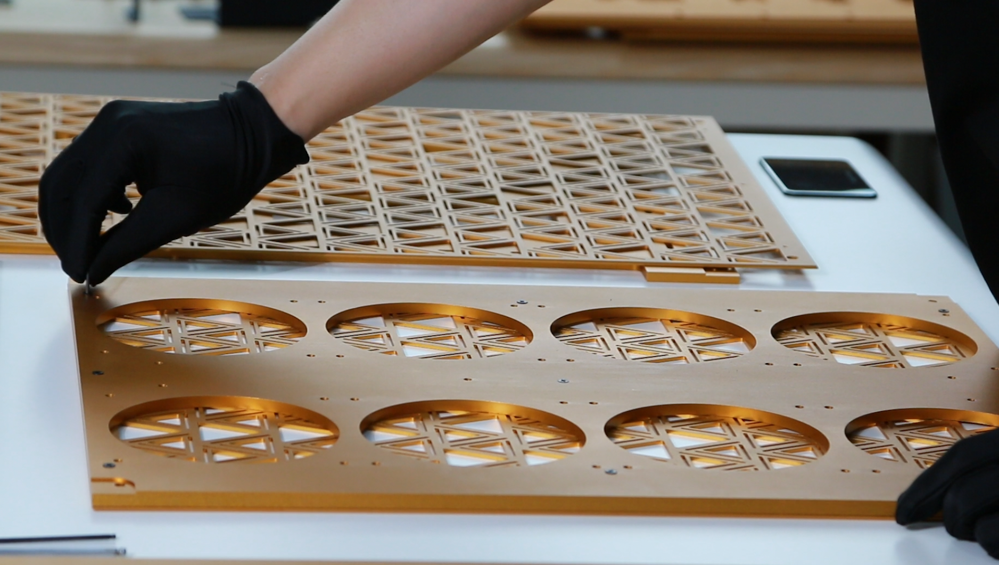 |
| 3 | Install the dust filter. | 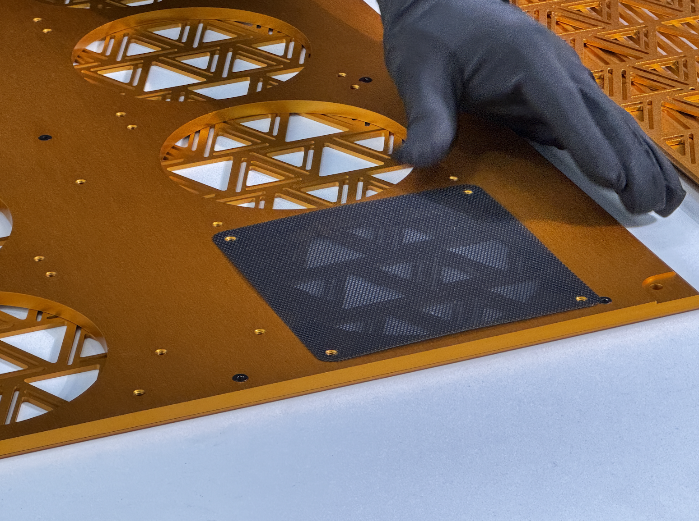 |
| 4 | Assemble the 120 mm × 120 mm fan. |  |
| 5 | Install the remaining fans. |  |
| 6 | Connect all fans to the control board. | 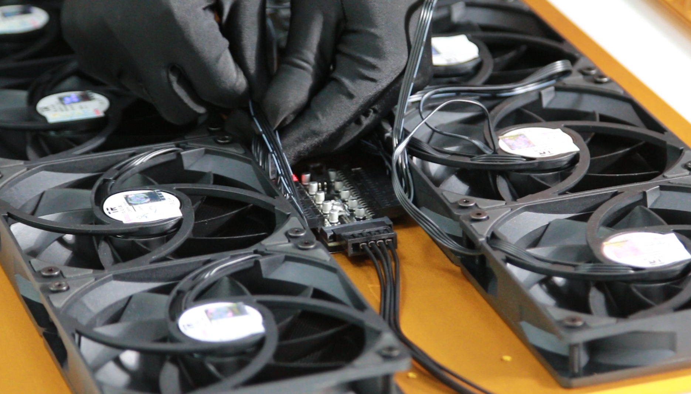 |
| 7 | Place plastic spacers in position on “Part 2 – CPU Plate”. |  |
| 8 | Fix the PSU board to “Part 2 – CPU Plate”. |  |
| 9 | Insert all screws, but do not tighten them yet. |  |
| 10 | Assemble the Ethernet board into “Part 10 – PSU Mount”. |  |
| 11 | Place “Part 10 – PSU Mount” into position. |  |
| 12 | Place “Part 1 – GPU Plate” on top. |  |
| 13 | Place all middle parts onto “Part 5 – Bottom”. | 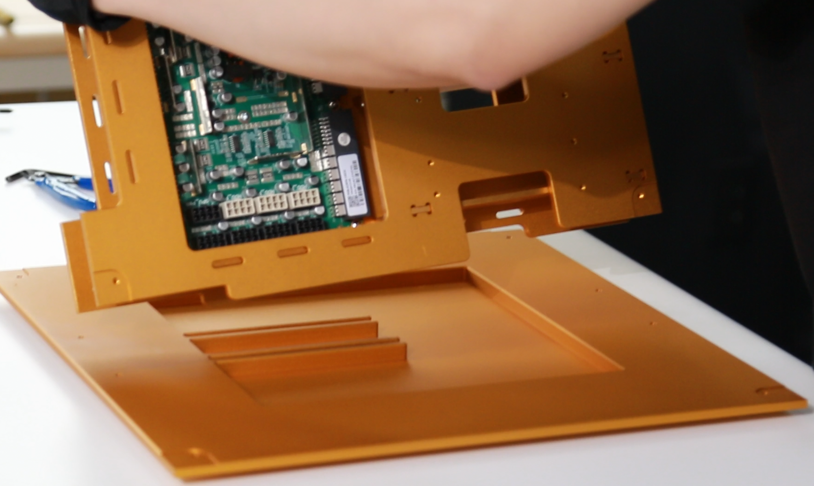 |
| 14 | Place all support mounts into position. |  |
| 15 | Secure with M4 × 8 mm screws. |  |
| 16 | Place “Part 4 – Back” into position and secure it with M4 screws. |  |
| 17 | Install all four PSUs into position and connect them to the PSU board. |  |
| 18 | Tighten all screws on the PSU board. |  |
| 19 | Install M4 × 15 mm copper spacers into the M4 holes on the other side. | 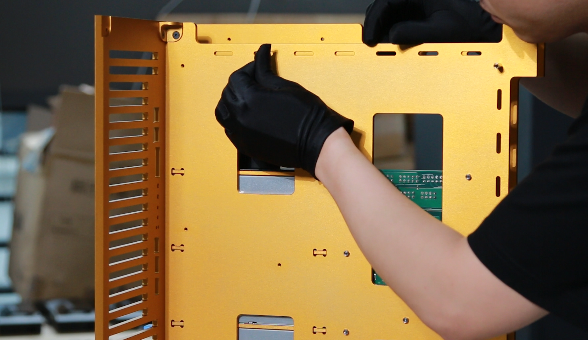 |
| 20 | Place the “Motherboard GENOA2D24G-2L+” into position. | 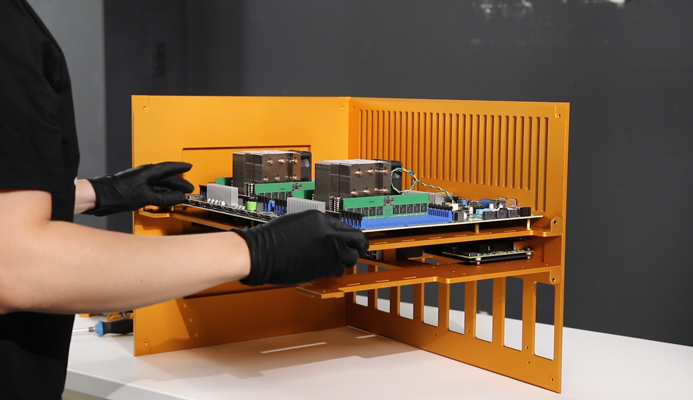 |
| 21 | Secure the motherboard to “Part 2 – CPU Plate” using M3 screws. | 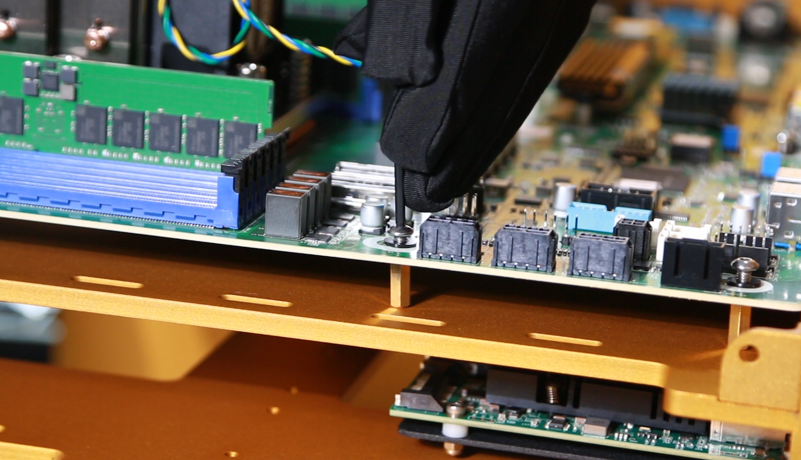 |
| 22 | Place 20 mm plastic spacers under the PCI board and secure them with M4 screws. |  |
| 23 | Install the remaining components. |  |
| 24 | Just a photo  |  |
| 25 | Just a photo  |  |
| 26 | Place the assembled parts upright. | 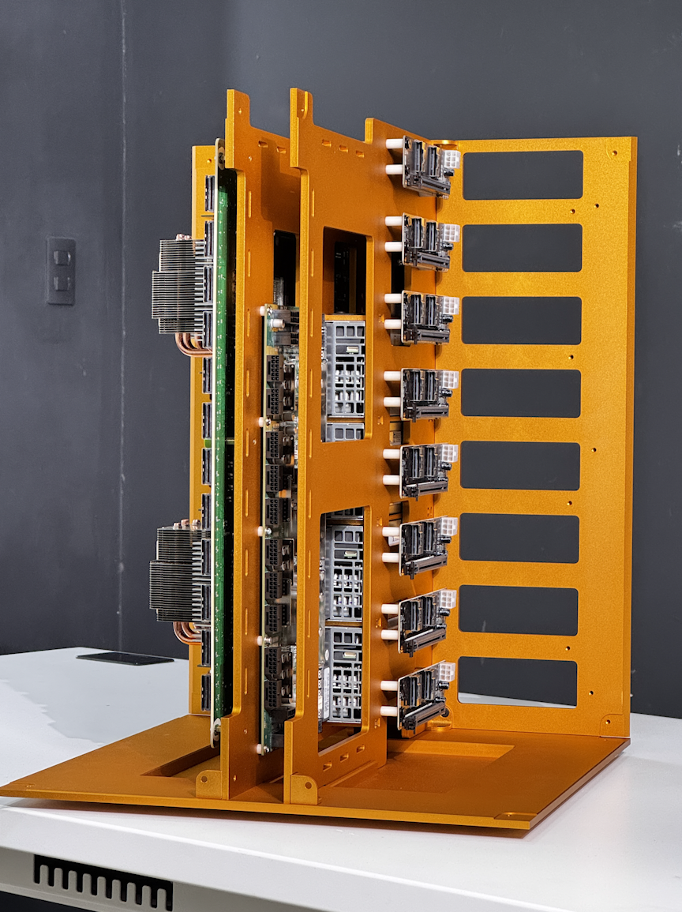 |
| 27 | Connect the PCI board cable to the motherboard. |  |
| 28 | Use zip ties to organize cables. | 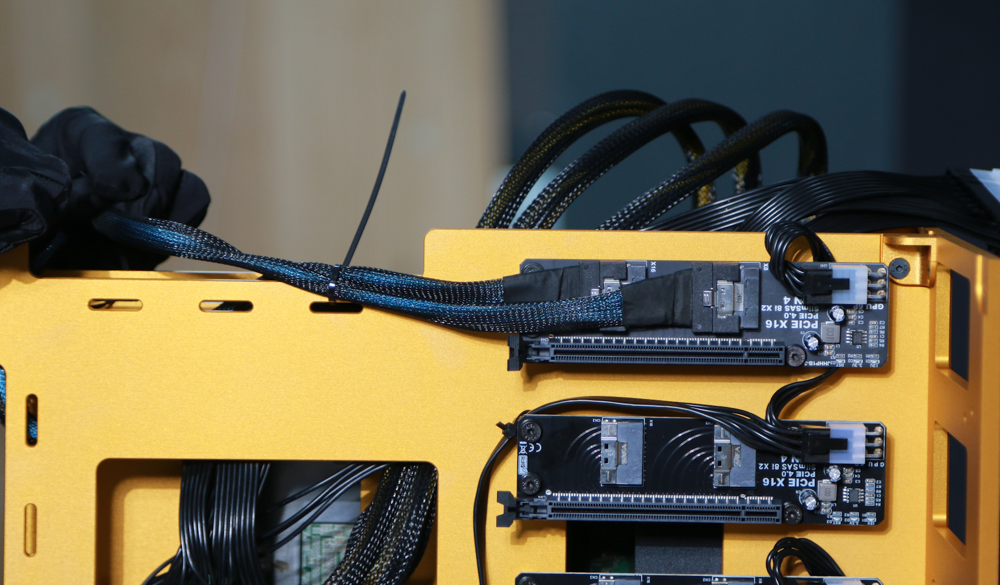 |
| 29 | Connect the power cable to the motherboard. |  |
| 30 | Connect MCIO cable to MCIO adapter |  |
| 31 | Place “Part 6 – Top” into position and secure it with M4 screws and the support plate. | 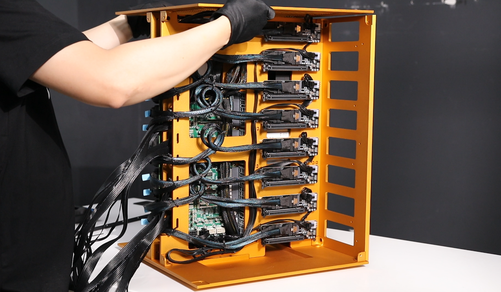 |
| 32 | Install 8 GPUs. |  |
| 33 | Secure the GPUs to the support rail. | 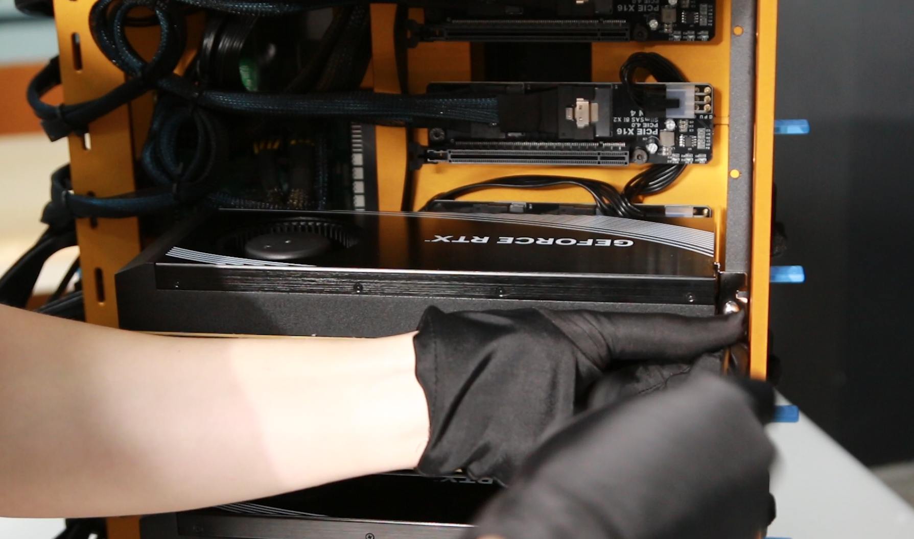 |
| 34 | Organize the power supply cables. |  |
| 35 | Connect the power supply cables. |  |
| 36 | Connect the fan board cable, then place the fan board into position. |  |
| 37 | Secure “Part 7 – Side”. |  |
| 38 | Repeat for the other side. |  |
| 39 | Connect the main power supply. |  |

---