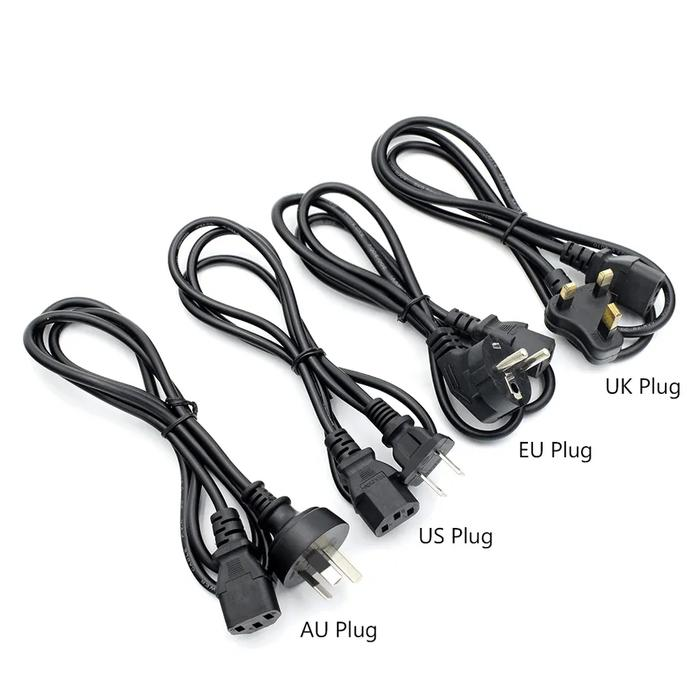

<table>
    <tr>
        <td valign="top" align="center" width="50%">
            <b>1. Motherboard GENOA2D24G-2L+</b> 
             
            <b>3. CPU AMD EPYC 9004</b> 
             
            <b>5. SSD NVME 1TB</b> 
             
            <b>7. RAM DDR5 48GB</b> 
             
            <b>9. MCIO Adapter</b> 
             
            <b>11. MCIO cable</b> 
             
            <b>13. Fan</b> 
             
        </td>
        <td valign="top" align="center" width="50%">
            <b>2. PSU board</b> 
             
            <b>4. CPU heat sink</b> 
             
            <b>6. SSD heat sink</b> 
             
            <b>8. PSU</b> 
             
            <b>10. Power cord</b> 
             
            <b>12. GPU</b> 
             
            <b>14. Hub fan</b> 
             
        </td>
    </tr>
</table>

---