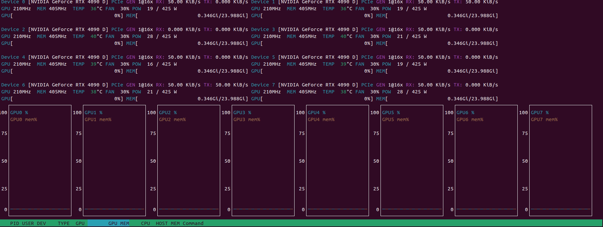

<p align="center">
    <a href="https://git.io/typing-svg">
        
    </a>
</p>

<p align="center">
    
</p>

<div align="center">


</div>

---

<div align="center">
    <b><i>
        This guide shows you how to build a cutting-edge AI server with 8x GPUs. From hardware selection to software setup, follow each step to create a high-performance platform for deep learning, data science, and GPU-intensive workloads.
    </i></b>
</div>

---

## 📚 Table of Contents
- [Introduction](#introduction)
- [Preparation](#preparation)
- [Assembly](#assembly)
- [Setup](#setup)
- [Testing](#testing)
- [BOM](#bom)
- [Author](#author)
- [License](#license)

---

## [I. Introduction 🙋🏻‍♂️🙋🏻‍♀️🙋‍♀️🙋🏻🙋🏽‍♂️🙋🏼‍♂️🙋🏽‍♀️💁‍♂️🙋🏼🙋🏾‍♂️✋✋✋✋✋✋✋✋](https://github.com/OpenHWEdgeAI/8xGPUs/tree/main?tab=readme-ov-file#introduction) &ensp; [🔝](#-table-of-contents)

<table>
    <tr>
        <td align="center" width="55%">
            <b><i>
                This tutorial is for anyone aiming to build a high-performance AI server with 8 GPUs. Whether you're a researcher, developer, or enthusiast, you'll learn everything from hardware selection and assembly to system configuration and initial testing. Finish with a robust platform ready for demanding AI workloads.
            </i></b>
        </td>
        <td align="center" width="45%">
            
        </td>
    </tr>
</table>

---

## [II. Preparation 🧑🏽‍🔧](https://github.com/OpenHWEdgeAI/8xGPUs/tree/main?tab=readme-ov-file#preparation) &ensp; [🔝](#-table-of-contents)

### 1. [**Electronic & Electrical**](https://github.com/OpenHWEdgeAI/8xGPUs/blob/main/Docs/Prepare_EE.md)


### 2. [**Mechanical & Housing**](https://github.com/OpenHWEdgeAI/8xGPUs/blob/main/Docs/Prepare_ME.md)


## [**III. Assembly 🦾**](https://github.com/OpenHWEdgeAI/8xGPUs/blob/main/Docs/Assembly.md) &ensp; [🔝](#-table-of-contents)


## [IV. Setup 🛠️](https://github.com/OpenHWEdgeAI/8xGPUs/tree/main?tab=readme-ov-file#setup) &ensp; [🔝](#-table-of-contents)

### BIOS Optimization for GPU Performance

> **Tip:** The default BIOS settings may not deliver optimal performance for multi-GPU workloads. Adjust these parameters for best results:

- **PCIe Settings** <br>
    🚨📢🔔⚠️
    Set all PCIe slots to the highest supported speed (Gen4/Gen5) and configure bifurcation for your GPUs.<br>
    ```
    Advanced -> Chipset Configuration -> PCIE link width -> set MCIO2/1, MCIO4/3, MCIO6/5, MCIO8/7, MCIO12/11, MCIO14/13, MCIO16/15, MCIO18/17 to x16
    ```

- **Above 4G Decoding** <br>
    🚨📢🔔⚠️
    Enable "Above 4G Decoding" to address large GPU memory.<br>
    ```
    May be enabled by default
    ```

- **Resizable BAR** <br>
    🚨📢🔔⚠️
    Activate "Resizable BAR" for improved CPU-GPU data transfer.<br>
    ```
    Advanced -> PCI Subsystems Settings -> Enable Re-size BAR support
    ```

- **Power Management**  
    Disable unnecessary power-saving features (C-states, ASPM) that may throttle GPU performance.<br>
    `Optional`

- **Memory Configuration**  
    Set RAM to rated speed and enable XMP/DOCP profiles for max bandwidth.<br>
    `Optional`

- **Fan and Thermal Controls**  
    Adjust fan curves and thermal limits for optimal cooling.<br>
    `Optional`

After saving changes, reboot and monitor GPU performance and stability.

**References:**  
- [Motherboard User Manual 💻🖱️](https://download.asrock.com/Manual/GENOA2D24G-2L%2b.pdf)  
- [BMC Documents 🤖](https://download.asrock.com/Manual/BMC/GENOA2D24G-2L%2b.pdf)

<p align="center">
    <video src="https://github.com/user-attachments/assets/41cd6d5d-9acd-41d6-b9c2-4da4666f3870"></video>
</p>

---

## [V. Testing 🕵🏻](https://github.com/OpenHWEdgeAI/8xGPUs/tree/main?tab=readme-ov-file#testing) &ensp; [🔝](#-table-of-contents)

Boot with WinPE from USB to verify hardware, or install Linux, NVIDIA drivers, and check with `nvtop`. Once confirmed, install your OS and start your AI work.

<table>
    <tr>
        <td align="center">
            <br>
        </td>
        <td align="center">
            <br>
        </td>
    </tr>
</table>

<p align="center">
    <video src="https://github.com/user-attachments/assets/71afbc5c-ae69-410e-868a-a52b915b1e7a"></video>
</p>

---

## [VI. BOM🗂️](https://github.com/OpenHWEdgeAI/8xGPUs/tree/main?tab=readme-ov-file#bom) &ensp; [🔝](#-table-of-contents)

- [𝄜 Bill of Materials](https://github.com/OpenHWEdgeAI/8xGPUs/blob/main/BOM/BOM_8GPUs.xlsx)
---

## [VII. Author ✍️](https://github.com/OpenHWEdgeAI/8xGPUs/tree/main?tab=readme-ov-file#author) &ensp; [🔝](#-table-of-contents)


---

## [VIII. License📝](https://github.com/OpenHWEdgeAI/8xGPUs/tree/main?tab=readme-ov-file#license) &ensp; [🔝](#-table-of-contents)

This project is open source under the [MIT License](https://github.com/OpenHWEdgeAI/8xGPUs/blob/main/LICENSE).

---

<p align="center">
    <a href="https://git.io/typing-svg">
        
    </a>
</p>