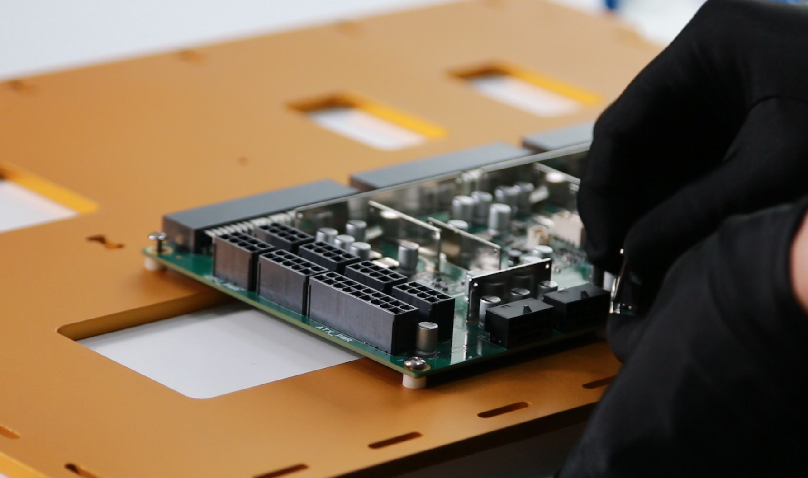
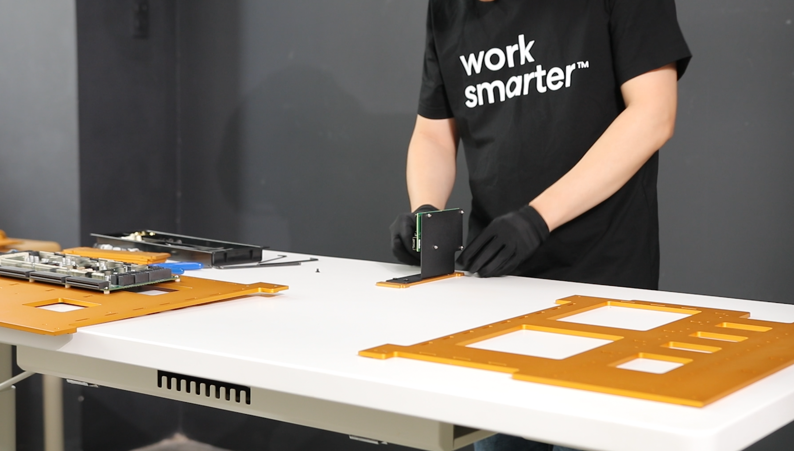

<p align="center">
    <a href="https://git.io/typing-svg">
        
    </a>
</p>

<p align="center">
    
</p>

<div align="center">


</div>

---

<div align="center">
    <b><i>
        This guide shows you how to build a cutting-edge AI server with 8x GPUs. From hardware selection to software setup, follow each step to create a high-performance platform for deep learning, data science, and GPU-intensive workloads.
    </i></b>
</div>

---

## 📚 Table of Contents
- [Introduction](#-introduction)
- [Preparation](#-preparing)
- [Assembly](#-assembling)
- [Setup](#-setup)
- [Testing](#-testing)
- [GG Drive](#-gg-drive)
- [BOM](#bom) *(update soon)*
- [Author](#author)
- [License](#license)

---

## [I. Introduction 🙋🏻‍♂️🙋🏻‍♀️🙋‍♀️🙋🏻🙋🏽‍♂️🙋🏼‍♂️🙋🏽‍♀️💁‍♂️🙋🏼🙍‍♂️🙋🏾‍♂️✋✋✋✋✋✋✋✋](#-introduction) &ensp; [🔝](#-table-of-contents)

<table>
    <tr>
        <td align="center" width="55%">
            <b><i>
                This tutorial is for anyone aiming to build a high-performance AI server with 8 GPUs. Whether you're a researcher, developer, or enthusiast, you'll learn everything from hardware selection and assembly to system configuration and initial testing. Finish with a robust platform ready for demanding AI workloads.
            </i></b>
        </td>
        <td align="center" width="45%">
            
        </td>
    </tr>
</table>

---

## [II. Preparation 🧑🏽‍🔧](#-preparing) &ensp; [🔝](#-table-of-contents)

### 1. **Electronic & Electrical**

<table>
    <tr>
        <td valign="top" align="center" width="50%">
            <b>1. Motherboard GENOA2D24G-2L+</b><br>
            <br>
            <b>3. CPU AMD EPYC 9004</b><br>
            <br>
            <b>5. SSD NVME 1TB</b><br>
            <br>
            <b>7. RAM DDR5 48GB</b><br>
            <br>
            <b>9. MCIO Adapter</b><br>
            <br>
            <b>11. MCIO cable</b><br>
            <br>
            <b>13. Fan</b><br>
            <br>
        </td>
        <td valign="top" align="center" width="50%">
            <b>2. PSU board</b><br>
            <br>
            <b>4. CPU heat sink</b><br>
            <br>
            <b>6. SSD heat sink</b><br>
            <br>
            <b>8. PSU</b><br>
            <br>
            <b>10. Power cord</b><br>
            <br>
            <b>12. GPU</b><br>
            <br>
            <b>14. Hub fan</b><br>
            <br>
        </td>
    </tr>
</table>

---

### 2. **Mechanical & Housing**

<table>
    <tr>
        <td valign="top" align="center" width="50%">
            <b>1. CNC Mill</b><br>
            <br>
            <b>3. Anodized</b><br>
            <br>
        </td>
        <td valign="top" align="center" width="50%">
            <b>2. Sand blasting</b><br>
            <br>
            <b>4. Anodized</b><br>
            <br>
        </td>
    </tr>
</table>

<p align="center">
    <video src="https://github.com/user-attachments/assets/05ee937c-a871-4809-914b-d98930b31777"></video>
</p>

---

## [III. Assembly 🦾](#-assembling) &ensp; [🔝](#-table-of-contents)

| Step | Description | Image |
|------|-------------|-------|
| 1 | Prepare all components. |  |
| 2 | Assemble “Part 7 – Side†and “Part 8 – Side Cover†together. Repeat for the other side. |  |
| 3 | Install the dust filter. |  |
| 4 | Assemble the 120 mm × 120 mm fan. |  |
| 5 | Install the remaining fans. |  |
| 6 | Connect all fans to the control board. |  |
| 7 | Place plastic spacers in position on “Part 2 – CPU Plate”. |  |
| 8 | Fix the PSU board to “Part 2 – CPU Plate”. |  |
| 9 | Insert all screws, but do not tighten them yet. |  |
| 10 | Assemble the Ethernet board into “Part 10 – PSU Mount”. |  |
| 11 | Place “Part 10 – PSU Mount†into position. |  |
| 12 | Place “Part 1 – GPU Plate†on top. |  |
| 13 | Place all middle parts onto “Part 5 – Bottom”. |  |
| 14 | Place all support mounts into position. |  |
| 15 | Secure with M4 × 8 mm screws. |  |
| 16 | Place “Part 4 – Back†into position and secure it with M4 screws. |  |
| 17 | Install all four PSUs into position and connect them to the PSU board. |  |
| 18 | Tighten all screws on the PSU board. |  |
| 19 | Install M4 × 15 mm copper spacers into the M4 holes on the other side. |  |
| 20 | Place the “Motherboard GENOA2D24G-2L+†into position. |  |
| 21 | Secure the motherboard to “Part 2 – CPU Plate†using M3 screws. |  |
| 22 | Place 20 mm plastic spacers under the PCI board and secure them with M4 screws. |  |
| 23 | Install the remaining components. |  |
| 24 | Just a photo  |  |
| 25 | Just a photo  |  |
| 26 | Place the assembled parts upright. |  |
| 27 | Connect the PCI board cable to the motherboard. |  |
| 28 | Use zip ties to organize cables. |  |
| 29 | Connect the power cable to the motherboard. |  |
| 30 | Connect MCIO cable to MCIO adapter |  |
| 31 | Place “Part 6 – Top†into position and secure it with M4 screws and the support plate. |  |
| 32 | Install 8 GPUs. |  |
| 33 | Secure the GPUs to the support rail. |  |
| 34 | Organize the power supply cables. |  |
| 35 | Connect the power supply cables. |  |
| 36 | Connect the fan board cable, then place the fan board into position. |  |
| 37 | Secure “Part 7 – Side”. |  |
| 38 | Repeat for the other side. |  |
| 39 | Connect the main power supply. |  |


---

## [IV. Setup 🛠️](#-setup) &ensp; [🔝](#-table-of-contents)

### BIOS Optimization for GPU Performance

> **Tip:** The default BIOS settings may not deliver optimal performance for multi-GPU workloads. Adjust these parameters for best results:

- **PCIe Settings** <br>
    🚨📢🔔⚠️
    Set all PCIe slots to the highest supported speed (Gen4/Gen5) and configure bifurcation for your GPUs.<br>
    ```
    Advanced -> Chipset Configuration -> PCIE link width -> set MCIO2/1, MCIO4/3, MCIO6/5, MCIO8/7, MCIO12/11, MCIO14/13, MCIO16/15, MCIO18/17 to x16
    ```

- **Above 4G Decoding** <br>
    🚨📢🔔⚠️
    Enable "Above 4G Decoding" to address large GPU memory.<br>
    ```
    May be enabled by default
    ```

- **Resizable BAR** <br>
    🚨📢🔔⚠️
    Activate "Resizable BAR" for improved CPU-GPU data transfer.<br>
    ```
    Advanced -> PCI Subsystems Settings -> Enable Re-size BAR support
    ```

- **Power Management**  
    Disable unnecessary power-saving features (C-states, ASPM) that may throttle GPU performance.<br>
    `Optional`

- **Memory Configuration**  
    Set RAM to rated speed and enable XMP/DOCP profiles for max bandwidth.<br>
    `Optional`

- **Fan and Thermal Controls**  
    Adjust fan curves and thermal limits for optimal cooling.<br>
    `Optional`

After saving changes, reboot and monitor GPU performance and stability.

**References:**  
- [Motherboard User Manual 💻🖱️](https://download.asrock.com/Manual/GENOA2D24G-2L%2b.pdf)  
- [BMC Documents 🤖](https://download.asrock.com/Manual/BMC/GENOA2D24G-2L%2b.pdf)

<p align="center">
    <video src="https://github.com/user-attachments/assets/41cd6d5d-9acd-41d6-b9c2-4da4666f3870"></video>
</p>

---

## [V. Testing 🕵🏻](#-testing) &ensp; [🔝](#-table-of-contents)

Boot with WinPE from USB to verify hardware, or install Linux, NVIDIA drivers, and check with `nvtop`. Once confirmed, install your OS and start your AI work.

<table>
    <tr>
        <td align="center">
            <br>
        </td>
        <td align="center">
            <br>
        </td>
    </tr>
</table>

<p align="center">
    <video src="https://github.com/user-attachments/assets/71afbc5c-ae69-410e-868a-a52b915b1e7a"></video>
</p>

---

## [VI. GG Drive 🗂️](#-gg-drive) &ensp; [🔝](#-table-of-contents)

[📦 3D Step Models](https://drive.google.com/drive/folders/1CPBjhxc8X349RCH8z7i7xvXVxy29Kzuq)

---

## [VII. Author ✍️](#author) &ensp; [🔝](#-table-of-contents)


---

## [VIII. License📝](#license) &ensp; [🔝](#-table-of-contents)

This project is open source under the [MIT License](https://github.com/OpenHWEdgeAI/8xGPUs/blob/main/LICENSE).

---

<p align="center">
    <a href="https://git.io/typing-svg">
        
    </a>
</p>