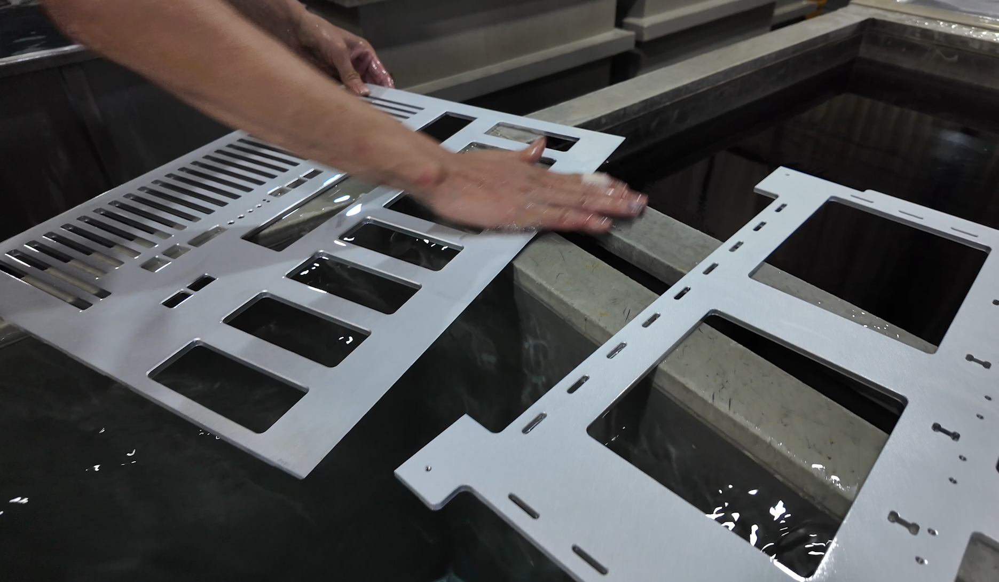

# 8xGPUs
A description which introduce building a server with 8xGPUs for AI 

## 📚 [Table of Contents](#-table-of-contents)
- [Introduction](#-introduction)
- [Preparing](#-preparing)
- [Assembling](#-assembling)
- [Setup](#-setup)
- [Testing](#-testing)

## [Introduction](#-introduction)        [🔝](#-table-of-contents)

We opened this tutorial for people who want to build their own AI server equipped with 8 GPUs. Whether you are a researcher, developer, or enthusiast, this guide will walk you through the entire process—from selecting compatible hardware, assembling components, configuring the system, to running initial tests. By following these steps, you can set up a powerful platform for deep learning, data science, or other GPU-intensive workloads.

## [Preparing](#-preparing)        [🔝](#-table-of-contents)

### I. Electronic & Electrical:
<table>
    <tr>
        <td align="center" width="50%">
            <b>1. Motherboard GENOA2D24G-2L+</b> 
             
            <b>2. CPU AMD EPYC 9004</b> 
             
            <b>3. RAM DDR5 ECC</b> 
             
            <b>4. SSD Samsung PRO 990 1TB</b> 
             
        </td>
        <td align="center" width="50%">
            <b>5. CPU Heatsink</b> 
             
            <b>6. SSD heat sink</b> 
             
            <b>7. PSU</b> 
             
            <b>8. Power board for PSU</b> 
             
            <b>9. Power cord</b> 
             
        </td>
    </tr>
</table>
 
 
 
 

### II. Mechanical & Housing
<table>
    <tr>
        <td align="center" width=50%>
            <b>1. CNC Mill </b>  
             
            <b>3. Anodized </b>  
             
        </td>
        <td align="center" width="50%">
            <b>2. Sand blasting </b>  
             
            <b>4. Anodized </b> 
             
        </td>
    </tr>
</table>

<video src="https://github.com/user-attachments/assets/05ee937c-a871-4809-914b-d98930b31777"></video>

## [Assembling](#-assembling) &ensp; &ensp; &ensp; &ensp;[🔝](#-table-of-contents)

## [Setup](#-setup) &ensp; &ensp; &ensp; &ensp;[🔝](#-table-of-contents)

## [Testing](#-testing) &ensp; &ensp; &ensp; &ensp;[🔝](#-table-of-contents)
